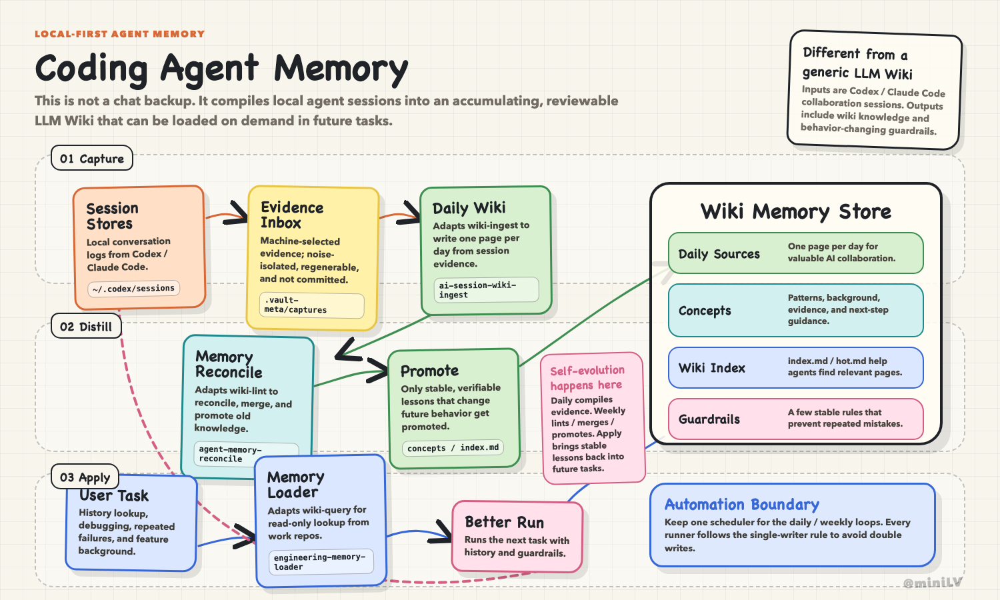
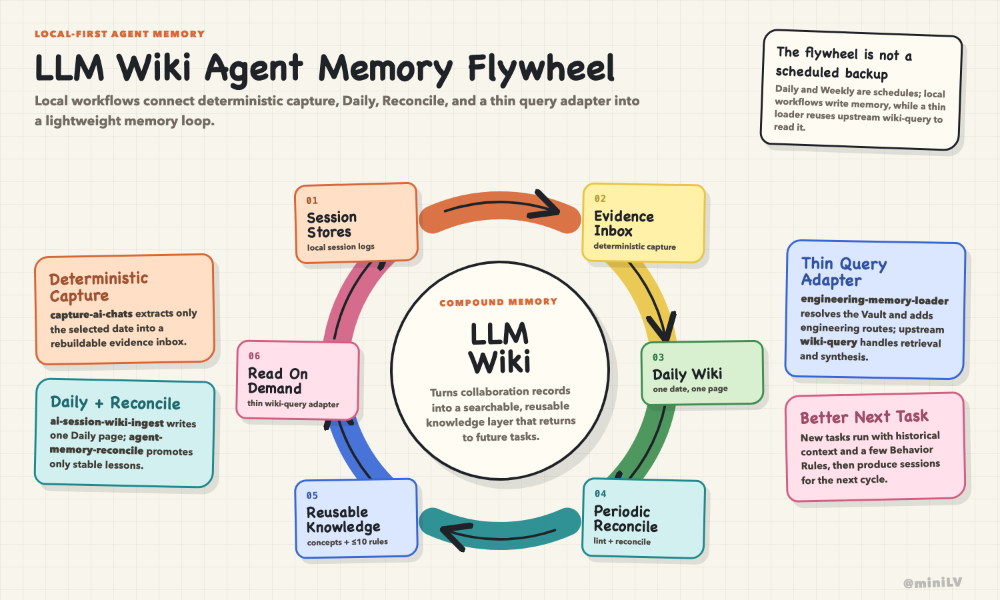
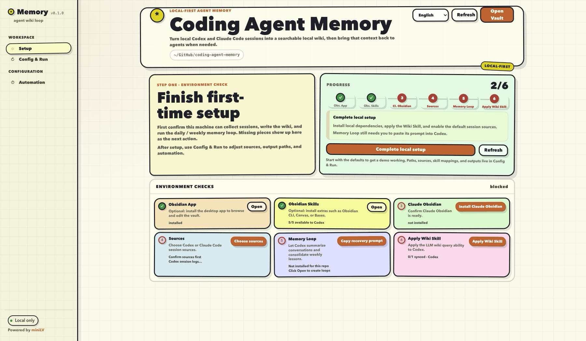

# LLM Wiki Agent Memory

**Make Codex and Claude Code remember your engineering work.** Turn local coding sessions into an auditable Markdown wiki, then retrieve prior decisions and debugging context from any repo.

**Plain Markdown, no vector database, and no hosted memory service required.**

[中文](README.md)


### What This Is

This is a local-first agent memory starter. Instead of growing `AGENTS.md` forever, it stores daily and weekly memory in `wiki/`, then exposes one query skill, `engineering-memory-loader`, so Codex can retrieve that memory from other repos.

Use it when:

- Agents forget what happened recently.
- Debugging needs old context or known failure modes.
- Product and engineering decisions are trapped in chat history.
- You want private local memory without a cloud service or a heavy RAG stack.

### Architecture Highlights

- Key-driven synthesis: the daily loop extracts Jira / issue / work item ids, features, repos, tools, and aliases, so inputs like `project1`, `ABC-123`, `PROJ42-987`, `AI VBG`, or `aivbg` can connect related sessions over time.
- Bounded but complete: capture keeps a chronological set of high-signal conversation highlights per session. Daily Wiki preserves important attempts, alternatives, evidence changes, conclusions, and unresolved work instead of collapsing a complex session into one sentence.
- Historical rollups: when one key matches five past sessions, the agent filters low-relevance matches and summarizes the timeline, decisions, repeated problems, current state, and next steps instead of returning five links.
- Two-layer memory: Daily Wiki pages keep concrete evidence and lookup keys; Weekly Review promotes only recurring topics into concepts / guardrails and keeps `index.md` / `hot.md` useful for future cross-session rollups.
- Visual evidence: daily capture extracts session screenshots into a local evidence inbox and scores their evidence value before promotion. When relationship complexity crosses the threshold, the workflow automatically creates or updates a topic Canvas; simpler chains use Mermaid or prose, while searchable text remains canonical.
- Anti-bloat rules: ordinary ticket / project keys are not promoted into durable memory by default; they are retrieved from Daily Wiki on demand. Only stable parent topics or long-running workstreams enter the index. Behavior rules are capped at 10 and must be merged, demoted, or pruned when full.
- Auditability: every Daily key topic links only its supporting capture Evidence Cards. Each card identifies Codex or Claude Code and retains the original session path; raw JSONL is opened only for exact output or disputed audits.

### Architecture Diagrams

Architecture: local sessions enter an evidence inbox, compile into Daily Wiki pages, get promoted by Weekly Review, and return to future tasks through the memory loader.



Flywheel: Daily records, Weekly lints / merges / promotes, and Apply brings lessons back into future tasks.



<sub>Both diagrams above were created with the [miniLV/sketchboard-diagram](https://github.com/miniLV/sketchboard-diagram) agent skill, which generates hand-drawn whiteboard-style HTML diagrams and exports them as PNG.</sub>

### Local Config UI

After you run the local config page, the UI looks like this. Follow the checks and buttons on the page:



### Quick Start

```bash
git clone https://github.com/miniLV/llm-wiki-agent-memory.git
cd llm-wiki-agent-memory
bash scripts/config-ui.sh --open
```

The browser opens a local web page bound to `127.0.0.1`. For the first run, follow the setup flow:

1. Check Obsidian, Obsidian Skills, Claude Obsidian, repo skills, and sources.
2. Install or open missing dependencies from the page.
3. Confirm sources. Codex session logs and Claude Code session logs are supported by default.
4. Run setup to link `engineering-memory-loader` into `~/.codex/skills/`.
5. Once the page is ready, copy the recent-week prompt or install Codex App Automations.

### Current Support

| Area | Current support |
|---|---|
| Sources | Supports Codex, Claude Code, and custom folders. Codex reads `~/.codex/sessions/` and `~/.codex/archived_sessions/`; Claude Code reads `~/.claude/projects/`. Session screenshots first enter the local evidence inbox, then Daily Wiki promotes only useful visual evidence. |
| Scheduled runner | Currently only Codex App Automations runs the daily / weekly jobs. To avoid double writes, one vault should have one scheduled writer; Codex CLI + launchd / cron and Claude Code runner support are still in progress. |

### Daily Use

After setup, you usually do not touch `.vault-meta/` or `wiki/sources/` by hand. Let Codex App Automations run the daily / weekly loops. When you want to backfill the recent week, copy the prompt from the local config page and run it manually in Codex.

Then ask Codex from any work repo:

```text
What did we mainly work on last week?
What problems did this feature hit before?
I changed the source, but the browser still shows old behavior. Check memory and help debug.
```

Codex loads the local query flow through `engineering-memory-loader` and reads only what it needs:

```text
wiki/hot.md
wiki/index.md
wiki/sources/ai-chats/
wiki/concepts/
wiki/guardrails/Guardrail Triggers.md
```

### Local and Private

- The config UI binds only to `127.0.0.1`.
- Local config is written to `.vault-meta/`, which is gitignored.
- `.agent/external/` stores third-party checkouts and is gitignored.
- Generated Daily Wiki pages may contain private project memory. Do not commit personal generated wiki content to a public starter repo.
- Raw session logs stay in their original local locations; this repo stores lightweight wiki pages and navigation.
- Session images first stay under gitignored `.vault-meta/captures/assets/`. Only visuals selected by Daily Wiki are copied into `wiki/assets/`; review them for private data before publishing a vault.

### Configure and Install

After the first `bash scripts/config-ui.sh --open`, you usually do not need to run install commands by hand. Obsidian Skills, Claude Obsidian, memory skill exposure, source confirmation, and Codex Automations can all be checked and installed from the local **Setup** page.

### Repo Map

```text
.agent/skills/
  ai-session-wiki-ingest/       # repo-local daily workflow
  agent-memory-reconcile/       # repo-local periodic workflow
  engineering-memory-loader/    # exported query skill

scripts/
  config-ui.sh                  # local config web entry
  setup.sh                      # skill setup entry
  capture-ai-chats.mjs          # deterministic evidence capture
  wiki-lint.mjs                 # deterministic wiki health report

wiki/
  sources/ai-chats/             # Daily Wiki pages
  assets/ai-chats/              # selected durable screenshots
  canvases/ai-chats/            # optional derived visual maps
  concepts/                     # reusable engineering lessons
  guardrails/                      # guardrail triggers and behavior rules
  index.md / hot.md / log.md    # navigation and recent context
```
