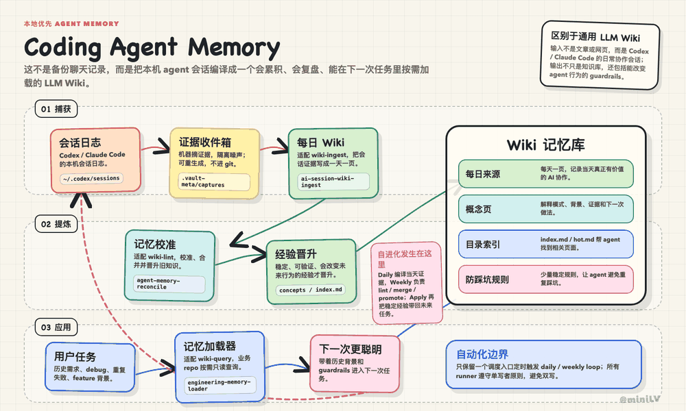
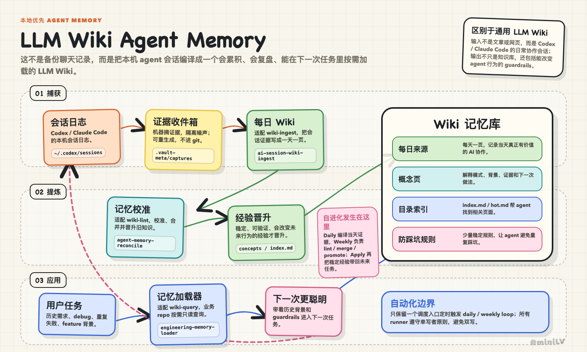
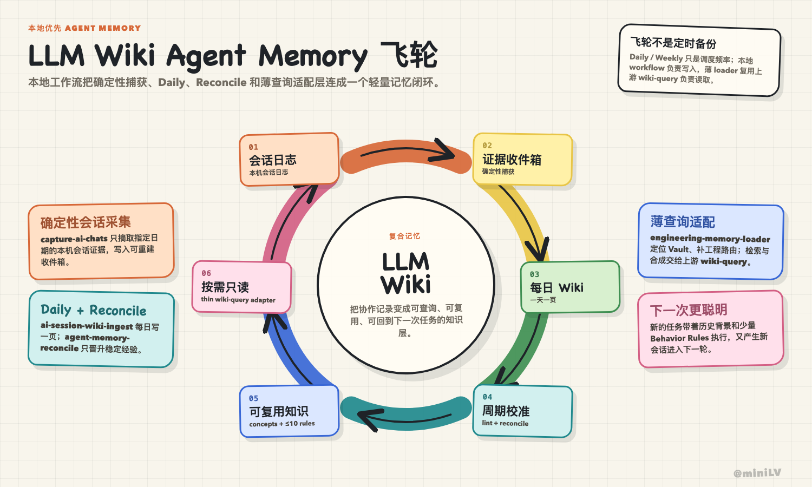
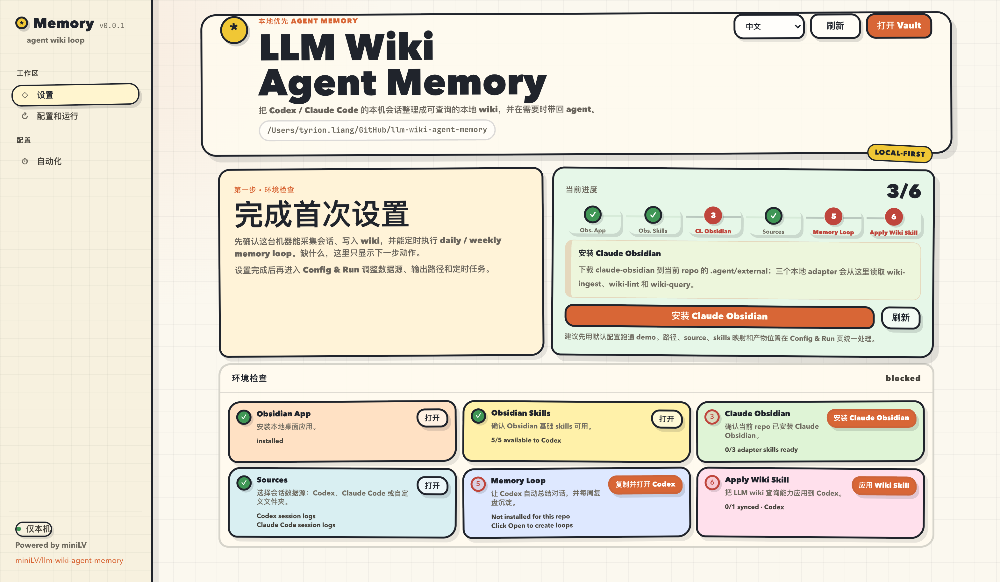

<h1 align="center">LLM Wiki Agent Memory</h1>

<p align="center">
  <strong>让 Codex / Claude Code 记住你做过的工程工作。</strong>
</p>

<p align="center">
  把本机会话编译成可查询、可审计的 Markdown Wiki；纯本地，无需向量数据库。
</p>

<p align="center">
  <a href="https://github.com/miniLV/llm-wiki-agent-memory/stargazers"></a>
  <a href="https://github.com/miniLV/llm-wiki-agent-memory/releases/latest"></a>
  <a href="LICENSE"></a>
</p>

<p align="center">
  <a href="https://github.com/miniLV/llm-wiki-agent-memory">GitHub</a> ·
  <strong>简体中文</strong> · <a href="./README.en.md">English</a>
</p>

<p align="center">
  <a href="#3-分钟开始"><strong>3 分钟开始</strong></a> ·
  <a href="#它解决什么"><strong>为什么需要它</strong></a> ·
  <a href="https://github.com/miniLV/llm-wiki-agent-memory/releases/latest"><strong>下载最新版</strong></a>
</p>

<p align="center">
  
</p>

## 它解决什么

AI 编程助手每次开启新任务，都可能重复调查你已经解决过的问题。这个项目把 Codex / Claude Code 的本机会话整理成一个 Markdown Wiki，再通过 `engineering-memory-loader` 按需找回历史背景、工程决策和防踩坑经验。

你会直接得到：

- **不再重复调查**：在新任务中召回以前的结论、命令和失败原因。
- **记忆可审计**：所有内容都是普通 Markdown，可以阅读、修改和 Git 管理。
- **数据留在本机**：不上传 session，不依赖向量数据库或托管记忆服务。
- **避免 AI 自我强化**：未经复核的 Daily 候选不会直接成为长期经验。

## 3 分钟开始

```bash
git clone https://github.com/miniLV/llm-wiki-agent-memory.git
cd llm-wiki-agent-memory
bash scripts/config-ui.sh --open
```

如果这个项目解决了你的 Agent 失忆问题，欢迎点一个 ⭐，也欢迎在 Issues 里告诉我你的工作流。

## 架构亮点

整体架构：本机会话先进入 evidence inbox，再编译成 Daily Wiki；Weekly Review 负责晋升稳定经验，最终通过 memory loader 回到下一次任务。



自进化飞轮：Daily 负责记录，Weekly 负责 lint / 合并 / 晋升，Apply 负责让经验回到未来任务。



<sub>上面两张图使用 [miniLV/sketchboard-diagram](https://github.com/miniLV/sketchboard-diagram) 这个 agent skill 绘制；它可以快速生成同款手绘白板风 HTML 架构图并导出 PNG。</sub>

- Key-driven synthesis：Daily run 会保留 Jira / issue / work item id、feature、repo、tool 和 alias，让 `ABC-123`、`owner/repo#123`、`AI VBG`、`aivbg` 这类输入可以串起相关历史。
- 有界但完整：Capture 为每个 session 保留按时间排序的关键对话高光，Daily Wiki 会记录关键尝试、备选方案、证据变化、结论和未解决事项，而不是把复杂会话压成一句话。
- 自动汇总历史：当一个 key 命中多次历史会话时，agent 会过滤低相关项，再汇总时间线、关键决策、反复问题、当前状态和下一步。
- 两级记忆：Daily Wiki 保留具体 evidence 和检索 key；Weekly Review 只把反复出现的主题沉淀成 concept / guardrail，并维护 `index.md` / `hot.md`。
- 视觉证据：Daily capture 能从 session 中提取截图到本地 evidence inbox；图片按证据价值评分后才会进入 Wiki。关系复杂度达到门槛时自动生成或更新主题 Canvas，否则使用 Mermaid 或文字，文字总结始终是可检索的主记录。
- 防膨胀：普通 ticket / project key 不默认晋升成长期记忆；只有稳定父级主题或长期 workstream 才沉淀成 concept。`Agent Behavior Rules` 最多 10 条。
- 可审计：常规查询读 Daily Wiki / index；只有需要 exact command output 或争议证据时才回到原始 session link。

## 本地配置界面

运行本地配置页后，界面大概长这样。按页面上的检查项一步步补齐即可：



这个页面只绑定 `127.0.0.1`。第一次使用时，重点看左侧的 **设置**、**配置和运行**、**自动化** 三个入口：

1. 在 **设置** 页检查 Obsidian、Obsidian Skills、Claude Obsidian、数据源、Codex Automations 和查询 skill。
2. 缺什么就点页面里的安装、打开或刷新按钮。已有资源会直接复用。
3. 在 **配置和运行** 页确认数据源，默认支持 Codex session logs 和 Claude Code session logs，也可以加自定义文件夹。
4. 在 **自动化** 页复制 prompt 到 Codex App，创建或更新 daily / weekly memory loop。
5. 页面显示 ready 后，就可以在其他 repo 里直接问 Codex 历史问题。

## 平时怎么用

配置好之后，日常基本不用手动碰 `.vault-meta/` 或 `wiki/sources/`。让 Codex App Automations 定时跑 daily / weekly loop；需要整理最近一周时，也可以在本地配置页复制 prompt 手动跑一次。

之后在任意业务 repo 里直接问 Codex：

```text
帮我查一下最近一周主要做了什么
这个功能之前遇到过什么问题
我改了源码，但浏览器还是旧行为，帮我按历史经验排查一下
```

Codex 会通过 `engineering-memory-loader` 读取本地 wiki，优先看 `wiki/hot.md` / `wiki/index.md`，再按 key 搜索 Daily Wiki 和 concepts，最后综合成一个答案。

## 当前支持范围

| 类型 | 当前支持 |
|---|---|
| Source 输入 | 支持 Codex、Claude Code 和自定义文件夹。Codex 读取 `~/.codex/sessions/` 和 `~/.codex/archived_sessions/`；Claude Code 读取 `~/.claude/projects/`。Session 内的截图会先进入本地 evidence inbox，再由 Daily Wiki 选择有价值的视觉证据。 |
| Runner 定时执行 | 当前只支持 Codex App Automations 跑 daily / weekly job。为了避免双写，同一个 vault 只允许一个定时 runner 写入；Codex CLI + launchd / cron、Claude Code runner 还在开发中。 |

## 本地与隐私

- 本地配置页只绑定 `127.0.0.1`。
- 本地配置写入 `.vault-meta/`，该目录不会进入 git。
- `.agent/external/` 用于放第三方依赖 checkout，也不会进入 git。
- 原始 session logs 仍留在本机原位置；本 repo 只保存整理后的轻量 wiki 页面和导航。
- Session 图片先写入 gitignored 的 `.vault-meta/captures/assets/`；只有被 Daily Wiki 选中的视觉证据才复制到 `wiki/assets/`。公开 repo 前同样需要检查这些图片是否包含私人信息。
- 生成的 Daily Wiki 可能包含你的私有项目记忆。公开 starter repo 时，不要 commit 个人生成的 wiki 内容。

## 配置和安装

除了第一次运行 `bash scripts/config-ui.sh --open`，日常不需要手动跑安装命令。Obsidian Skills、Claude Obsidian、memory skill 暴露、数据源确认和 Codex Automations 都可以在本地 **设置** 页面里一键检查和安装。

## 目录速览

```text
.agent/skills/
  daily-ai-chat-pipeline/       # repo-local daily workflow
  weekly-ai-memory-review/      # repo-local weekly workflow
  engineering-memory-loader/    # exported query skill

scripts/
  config-ui.sh                  # local config web entry
  setup.sh                      # skill setup entry
  capture-ai-chats.mjs          # deterministic evidence capture
  wiki-lint.mjs                 # deterministic wiki health report

wiki/
  sources/ai-chats/             # Daily Wiki pages
  assets/ai-chats/              # selected durable screenshots
  canvases/ai-chats/            # optional derived visual maps
  concepts/                     # reusable engineering lessons
  guardrails/                   # guardrail triggers and behavior rules
  index.md / hot.md / log.md    # navigation and recent context
```

## 灵感来源

这套本地自进化知识库从 [Andrej Karpathy 的 LLM Wiki](https://gist.github.com/karpathy/442a6bf555914893e9891c11519de94f) 思路出发：把 external sources 编译成由 LLM 维护的 Markdown wiki，再用 schema 约束 agent 如何读取、更新和防止膨胀。感谢 Karpathy 把这个模式讲得足够清楚。

## 相关项目

组合使用体验更好：

- [Obsidian](https://github.com/obsidianmd/obsidian-releases)：本地 Markdown vault 和知识库应用。
- [Obsidian Skills](https://github.com/kepano/obsidian-skills)：统一提供 Obsidian Markdown 和 Canvas 能力；Daily workflow 在视觉证据或复杂链路场景下按需使用。
- [Claude Obsidian](https://github.com/AgriciDaniel/claude-obsidian)：提供 `wiki-query` 和 self-organizing wiki workflow。
