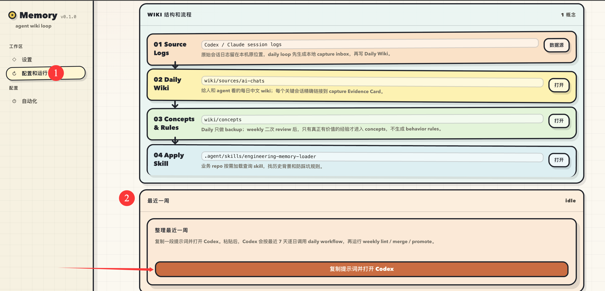
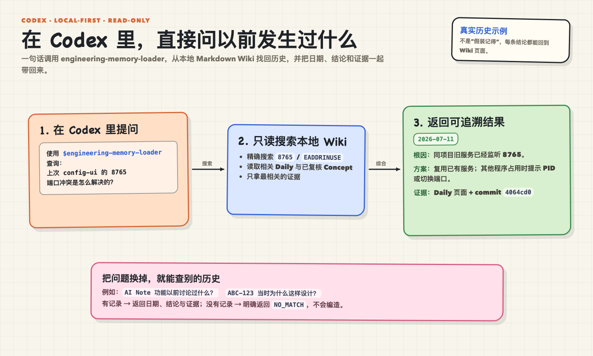

<h1 align="center">LLM Wiki Agent Memory</h1>

<p align="center">
  <strong>让 Codex / Claude Code 记住你做过的工程工作。</strong>
</p>

<p align="center">
  把本机会话编译成可查询、可审计的 Markdown Wiki；纯本地，无需向量数据库。
</p>

<p align="center">
  <a href="https://github.com/miniLV/llm-wiki-agent-memory/stargazers"></a>
  <a href="https://github.com/miniLV/llm-wiki-agent-memory/releases/latest"></a>
  <a href="LICENSE"></a>
</p>

<p align="center">
  <a href="https://github.com/miniLV/llm-wiki-agent-memory">GitHub</a> ·
  <strong>简体中文</strong> · <a href="./README.en.md">English</a>
</p>

<p align="center">
  <a href="#3-分钟开始"><strong>3 分钟开始</strong></a> ·
  <a href="#它解决什么"><strong>为什么需要它</strong></a> ·
  <a href="https://github.com/miniLV/llm-wiki-agent-memory/releases/latest"><strong>下载最新版</strong></a>
</p>

<p align="center">
  
</p>

## 它解决什么

AI 编程助手每次开启新任务，都可能重复调查你已经解决过的问题。这个项目把 Codex / Claude Code 的本机会话整理成一个 Markdown Wiki，再通过 `engineering-memory-loader` 按需找回历史背景、工程决策和防踩坑经验。

你会直接得到：

- **不再重复调查**：在新任务中召回以前的结论、命令和失败原因。
- **记忆可审计**：所有内容都是普通 Markdown，可以阅读、修改和 Git 管理。
- **数据留在本机**：不上传 session，不依赖向量数据库或托管记忆服务。
- **避免 AI 自我强化**：未经复核的 Daily 候选不会直接成为长期经验。

## 3 分钟开始

在一个已有的 Codex 项目任务中直接发送：

```text
帮我安装 [miniLV/llm-wiki-agent-memory](https://github.com/miniLV/llm-wiki-agent-memory)
```

Codex 会把仓库 clone 到当前项目目录内，读取仓库安装规范并完成只读预检。预检通过后回复“好”，Agent 会直接完成本地安装和 Daily / Weekly 自动化。配置网页不是必需步骤。

如果需要手动 clone：

```bash
git clone https://github.com/miniLV/llm-wiki-agent-memory.git
```

## 架构亮点

整体架构：本机会话先生成一份有界 Evidence Snapshot，再编译成 Daily Wiki；Weekly Review 负责晋升稳定经验，最终通过 memory loader 回到下一次任务。


自进化飞轮：Daily 负责记录，Weekly 负责 lint / 合并 / 晋升，Apply 负责让经验回到未来任务。


<sub>上面两张图使用 [miniLV/sketchboard-diagram](https://github.com/miniLV/sketchboard-diagram) 这个 agent skill 绘制；它可以快速生成同款手绘白板风 HTML 架构图并导出 PNG。</sub>

- Key-driven synthesis：Daily run 会保留 Jira / issue / work item id、feature、repo、tool 和 alias，让 `ABC-123`、`owner/repo#123`、`AI VBG`、`aivbg` 这类输入可以串起相关历史。
- 单层输入：raw session 是完整事实源；Daily run 生成一份可重新生成的 Evidence Snapshot，并把同一份内容一次性交给 agent。优先级和噪声过滤控制内容密度，不因 Snapshot 大小直接跳过日期。
- 自动汇总历史：当一个 key 命中多次历史会话时，agent 会过滤低相关项，再汇总时间线、关键决策、反复问题、当前状态和下一步。
- 两级记忆：Daily Wiki 保留具体 evidence 和检索 key；Weekly Review 只把反复出现且通过复核的主题沉淀成 Concept。
- 防膨胀：普通 ticket / project key 不默认晋升成长期记忆；只有稳定父级主题或长期 workstream 才沉淀成 Concept。
- 可审计：每个 Daily 「关键会话」展示 1-3 张代表性 Snapshot Evidence Card；Card 保留原始 session 路径，需要审计时可沿链接反查 raw session。

## 可复现验证

仓库内置的合成 fixture 不读取个人 session。下面这条命令会验证安装与卸载边界、Evidence Snapshot、Daily 工作流和严格 Wiki lint：

```bash
node --test scripts/*.test.mjs && node scripts/wiki-lint.mjs --strict
```

这些测试证明确定性的本地流程与来源约束可以复现；它们不把合成案例冒充真实用户 benchmark，也不评估 Agent 对未来工程问题的回答质量。后者正在 [#4](https://github.com/miniLV/llm-wiki-agent-memory/issues/4) 中设计，记忆模型仍以 [SCHEMA.md](SCHEMA.md) 为唯一规范。

## 安装

直接向 Codex 发送上面的 GitHub 安装请求，或把仓库手动 clone 到当前 Codex 项目目录内后让 Agent 执行安装。仓库不需要单独注册成 Codex 项目；安装器会把 Daily / Weekly automations 绑定到包含该仓库的当前项目，并在运行时切换到仓库目录。

普通安装请求会先进行只读预检，再确认一次完整安装范围：

```text
用户：安装这个项目

Codex：将安装本地依赖、确认 Codex 和 Claude 会话数据源、应用
engineering-memory-loader，并创建 Daily / Weekly 自动化。是否执行完整安装？

用户：好

Codex：开始完整安装……
```

如果不需要再次确认，可以直接说：

```text
请直接完整安装这个项目，包括 Daily / Weekly 自动化。
```

Agent 会运行非交互本地安装，再通过 Codex App 的正式工具创建或更新自动化；不会要求打开配置网页或复制粘贴 prompt。下面的配置界面只保留为状态检查和故障恢复入口。

## 卸载

推荐直接让 Codex 完成卸载，因为 Daily / Weekly automations 必须通过 Codex App 的正式工具删除：

```text
卸载这个 Agent Memory 项目
```

Agent 会先执行只读检查，说明即将删除的两个自动化和仓库所属全局 skill 链接，并询问一次确认。默认保留 `.vault-meta`、`.agent/external`、所有 Daily Wiki 页面和 Concepts。

只检查手动卸载范围：

```bash
bash scripts/uninstall.sh --dry-run --json
```

在已经通过 Codex 删除自动化后，手动删除仓库所属全局 skill 链接：

```bash
bash scripts/uninstall.sh --yes --json
```

如需同时删除可重新生成的本地配置、Evidence Snapshot 和第三方 checkout：

```bash
bash scripts/uninstall.sh --yes --purge-local-state --json
```

`--purge-local-state` 仍不会删除 `wiki/`。脚本不会卸载 Obsidian、删除仓库、删除其他安装的链接，或覆盖同名实体 skill 目录。

## 本地配置界面（手动）

运行本地配置页后，界面大概长这样。按页面上的检查项一步步补齐即可：


这个页面只绑定 `127.0.0.1`。第一次使用时，重点看左侧的 **设置**、**配置和运行**、**自动化** 三个入口：

1. 在 **设置** 页检查 Obsidian、Obsidian Skills、Claude Obsidian、数据源、Codex Automations 和查询 skill。
2. 缺什么就点页面里的安装、打开或刷新按钮。已有资源会直接复用。
3. 在 **配置和运行** 页确认数据源，默认支持 Codex session logs 和 Claude Code session logs，也可以加自定义文件夹。
4. **自动化** 页可以检查 daily / weekly memory loop；复制安装 prompt 仅作为 Agent 自动安装不可用时的恢复入口。
5. 页面显示 ready 后，就可以在其他 repo 里直接问 Codex 历史问题。

## 平时怎么用

配置好后有两种运行方式：

- **自动维护**：让 Codex App Automations 定时运行 daily / weekly memory loop，日常不用手动修改 `.vault-meta/` 或 `wiki/sources/`。
- **手动整理最近 7 天**：在本地配置页的 **最近一周** 卡片点击 **复制提示词并打开 Codex**，粘贴并发送。Codex 会按最近 7 天逐日运行 daily workflow，最后执行 weekly lint / merge / promote。



整理完成后，在任意业务 repo 里直接问 Codex：

```text
帮我查一下最近一周主要做了什么
这个功能之前遇到过什么问题
我改了源码，但浏览器还是旧行为，帮我按历史经验排查一下
```

Codex 会通过 `engineering-memory-loader` 读取本地 wiki，按问题读取最新 Daily 或按 key 搜索 Daily Wiki 和 Concepts，最后返回日期、结论和证据；没有记录时会明确返回 `NO_MATCH`。



## 当前支持范围

| 类型 | 当前支持 |
|---|---|
| Source 输入 | 支持 Codex、Claude Code 和自定义文件夹。Codex 读取 `~/.codex/sessions/` 和 `~/.codex/archived_sessions/`；Claude Code 读取 `~/.claude/projects/`。Raw session 保持原位，Daily 只接收一次有界 Evidence Snapshot。 |
| Runner 定时执行 | 当前只支持 Codex App Automations 跑 daily / weekly job。为了避免双写，同一个 vault 只允许一个定时 runner 写入；Codex CLI + launchd / cron、Claude Code runner 还在开发中。 |

## 本地与隐私

- 本地配置页只绑定 `127.0.0.1`。
- 本地配置写入 `.vault-meta/`，该目录不会进入 git。
- `.agent/external/` 用于放第三方依赖 checkout，也不会进入 git。
- 原始 session logs 仍留在本机原位置；gitignored 的 `.vault-meta/` 保存可重新生成的 Evidence Snapshot，wiki 保存整理后的轻量页面和导航。
- 生成的 Daily Wiki 可能包含你的私有项目记忆。公开 starter repo 时，不要 commit 个人生成的 wiki 内容。

## 目录速览

```text
.agent/skills/
  agent-memory-setup/           # repo-local complete installer
  agent-memory-uninstall/       # repo-local safe uninstaller
  ai-session-wiki-ingest/       # repo-local daily workflow
  agent-memory-reconcile/       # repo-local periodic workflow
  engineering-memory-loader/    # exported query skill

scripts/
  config-ui.sh                  # local config web entry
  setup.sh                      # skill setup entry
  uninstall.sh                  # safe local uninstall entry
  capture-ai-chats.mjs          # deterministic bounded Evidence Snapshot
  daily-memory-workflow.mjs     # one-shot Snapshot prepare and Daily verify
  wiki-lint.mjs                 # deterministic wiki health report

wiki/
  sources/ai-chats/             # Daily Wiki pages
  concepts/                     # reusable engineering lessons
  index.md / log.md             # stable routing and operation log
```

## 灵感来源

这套本地自进化知识库从 [Andrej Karpathy 的 LLM Wiki](https://gist.github.com/karpathy/442a6bf555914893e9891c11519de94f) 思路出发：把 external sources 编译成由 LLM 维护的 Markdown wiki，再用 schema 约束 agent 如何读取、更新和防止膨胀。感谢 Karpathy 把这个模式讲得足够清楚。

## 相关项目

组合使用体验更好：

- [Obsidian](https://github.com/obsidianmd/obsidian-releases)：本地 Markdown vault 和知识库应用。
- [Obsidian Skills](https://github.com/kepano/obsidian-skills)：提供 Obsidian Markdown 和 Canvas 能力，可在用户明确需要图示时单独使用。
- [Claude Obsidian](https://github.com/AgriciDaniel/claude-obsidian)：提供 `wiki-query` 和 self-organizing wiki workflow。
